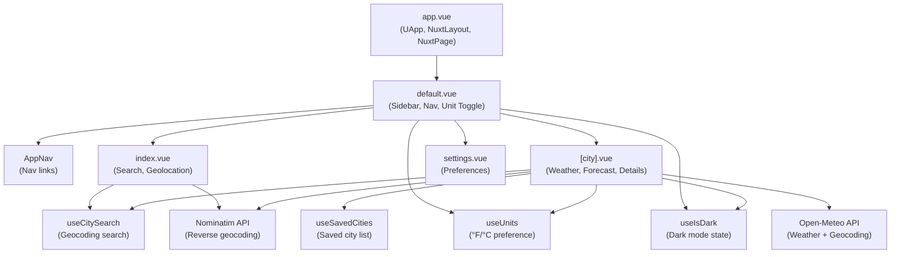

# README

A weather dashboard showing current conditions, today's forecast, and a 7-day forecast.

## Features

- Search for cities by name with live autocomplete
- Detect current location using browser geolocation
- Current conditions including temperature, weather description, feels like, humidity, wind, and precipitation
- Today's hourly forecast
- 7-day forecast
- Location display name resolved from coordinates (city, region, country)
- Saved cities list persisted to localStorage
- °F/°C toggle persisted to localStorage
- Supports both light and dark mode

## Tech Stack

- Vue.js 3
- Nuxt 4
- Nuxt UI
- TypeScript
- Tailwind CSS 4
- Open-Meteo (weather data and geocoding)
- Meteocons (two different weather icon sets for light and dark mode)
- Nominatim / OpenStreetMap (reverse geocoding)

## Run Locally

```sh
npm install
npm run dev # http://localhost:3000
```

## Architecture



### Design inspiration

The design and appearance of this app are strongly influenced by Uizard's [Weather web app design template (dark)](https://uizard.io/templates/web-app-templates/weather-web-app-dark/)

- I'm recreating all UI elements and assets from scratch as a web app
- I'm omitting some features and adding others (light mode, radar) to suit my own preferences
- This is a small demo for a personal web development portfolio and it will never be sold. The goal is to demonstrate my familiarity with Vue.js, Nuxt, Nuxt UI, TypeScript, and public APIs.

## Future enhancements

- Settings page to select units for temperature, wind speed, precipitation, etc.
- Locations page to maintain a list of saved locations
- Radar for current location via free [RainViewer API](https://www.rainviewer.com/api.html)
- Many more UI refinements and code refactoring
