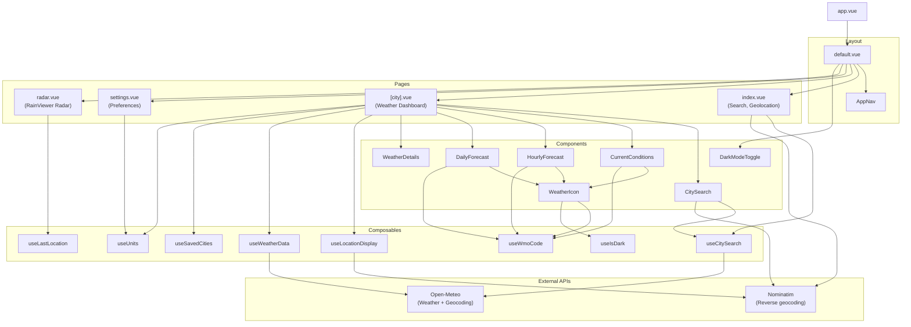

# README

A weather dashboard showing current conditions, today's forecast, and a 7-day forecast.

## Features

- Search for cities by name with live autocomplete
- Detect current location using browser geolocation
- Current conditions including temperature, weather description, feels like, humidity, wind, and precipitation
- Today's hourly forecast
- 7-day forecast
- Location display name resolved from coordinates (city, region, country)
- Supports both light and dark mode
- Settings page to select preferred units and persist them to localStorage

## Tech Stack

- Vue.js 3
- Nuxt 4
- Nuxt UI
- TypeScript
- Tailwind CSS 4
- Open-Meteo (weather data and geocoding)
- Meteocons (two different weather icon sets for light and dark mode)
- Nominatim / OpenStreetMap (reverse geocoding)

## Run Locally

```sh
npm install
npm run dev # http://localhost:3000
```

## Architecture



## Design inspiration

The design of this app was influenced by Uizard's [Weather web app design template (dark)](https://uizard.io/templates/web-app-templates/weather-web-app-dark/)

- I recreated all UI elements and assets from scratch as a web app
- I omitted some features and adding others (light mode, radar) to suit my own preferences
- This is a small demo for a personal web development portfolio and it will never be sold. The goal is to demonstrate my familiarity with Vue.js, Nuxt, Nuxt UI, TypeScript, and public APIs.

## Future enhancements

- Cycle through radar animation frames
- Click on hourly forecast to display Details for that hour
- Cities page to maintain a list of saved locations?
- Chart visualization of 7 day forecast ala Weather Underground?
- Possible design overhaul to separate daily forecast from 7-day outlook
