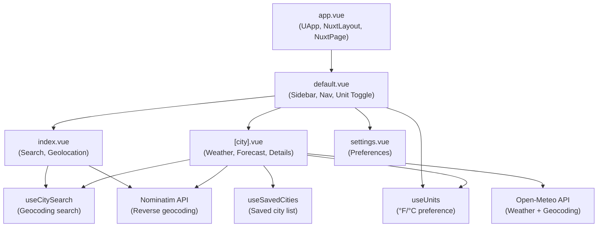

# README

A weather dashboard showing current conditions, today's forecast, and a 7-day forecast.

## Features

- Search for cities by name with live autocomplete
- Detect current location using browser geolocation
- Current conditions including temperature, weather description, feels like, humidity, wind, and precipitation
- Today's hourly forecast
- 7-day forecast
- Location display name resolved from coordinates (city, region, country)
- Saved cities list persisted to localStorage
- °F/°C toggle persisted to localStorage
- Light/dark mode toggle

## Tech Stack

- Vue.js 3
- Nuxt 4
- TypeScript
- Nuxt UI
- Tailwind CSS 4
- Open-Meteo (weather data and geocoding)
- Nominatim / OpenStreetMap (reverse geocoding)

## Run locally

```sh
npm install
npm run dev # http://localhost:3000
```

## Architecture


